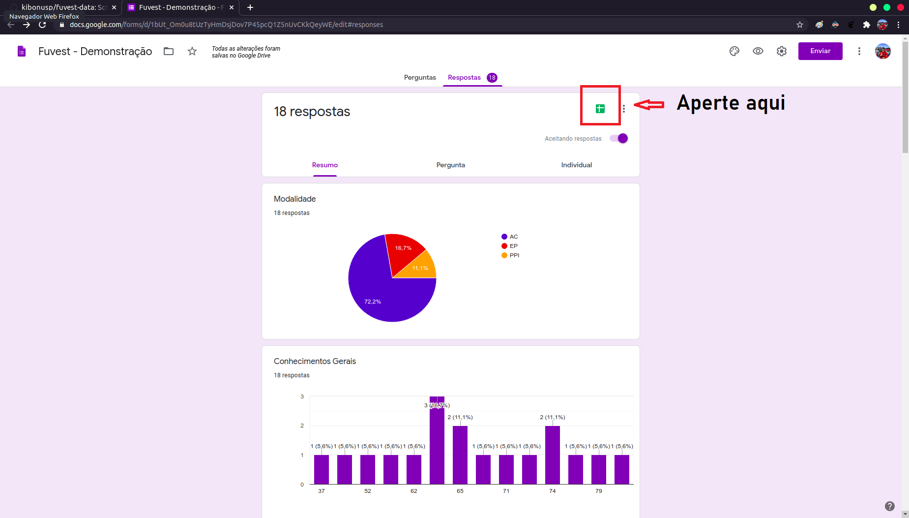
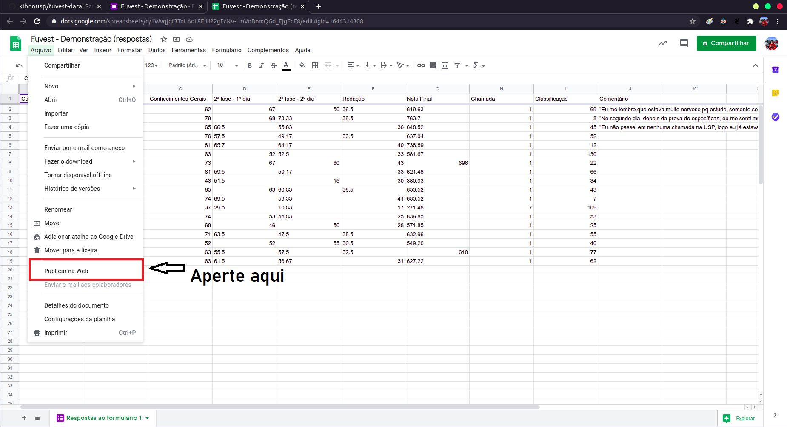
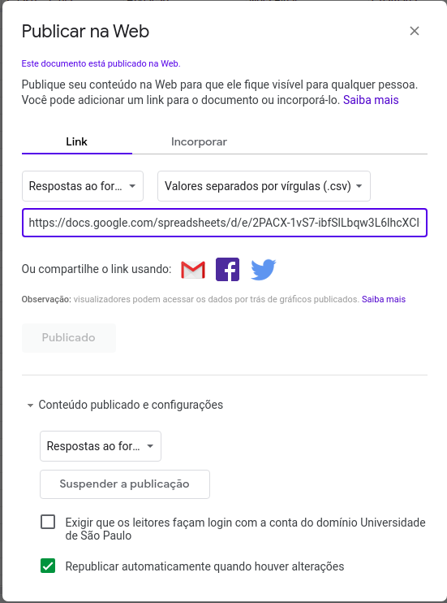

# fuvest-data
Script para criação de PDF com gráficos acerca dos aprovados de um curso pela Fuvest e com mensagens de veteranos.

### Instalando o repositório
Para obter o repositório, use o seguinte comando:
```$ git clone https://github.com/kibonusp/fuvest-data.git```
Antes de poder executar o programa, é necessário ter as bibliotecas **pandas**, **numpy**. **matplotlib** e **pdfkit**. Para isso, utilize:
```
pip install -r requirements.txt
```


### Obtendo o CSV de um Google Sheets a partir de um Google Forms
O programa funciona a partir da criação de um Google Forms com perguntas iguais a desse [aqui](https://forms.gle/Qi5fPkwZbbtsBz3F7)

Ao visualizar as respostas do seu Google Forms, é possível abrir uma planilha do Google Sheets com as respostas do formulário:


Uma vez dentro da planilha, é preciso pegar a url relativa ao csv dessa planilha.



### Executando o programa

Para executar o programa, use o comando:
```$ python3 main.py```

O programa irá perguntar se você deseja criar um PDF para uma nova turma ou não.

##### Escolhendo sim
Caso você tenha escolhido sim, o programa pede a url do googlesheets obtida anteriormente.
Após isso, perguntará o nome da sua unidade de ensino, do seu curso e o seu ano de ingresso.
Uma vez preenchidas as perguntas, o programa deverá ter criado uma pasta contendo o PDF, os gráficos e uma página HTML e terminará sua execução.
Usufrua do que estiver interessado.
    
##### Escolhendo não
Caso você tenha escolhido não, o programa perguntará se você deseja atualizar os dados ou se deseja sair.
Caso tenha escolhido atualizar, o PDF, os gráficos e o html serão atualizados dada a condição da planilha no momento.
Caso contrário, o programa encerrará sua execução.